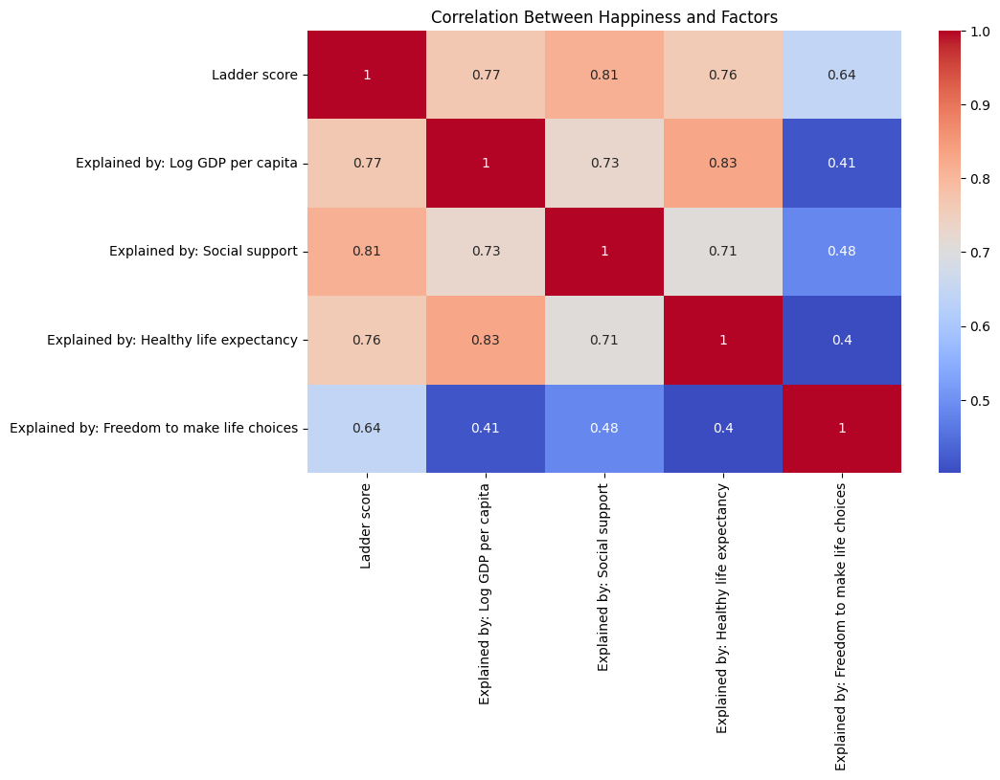
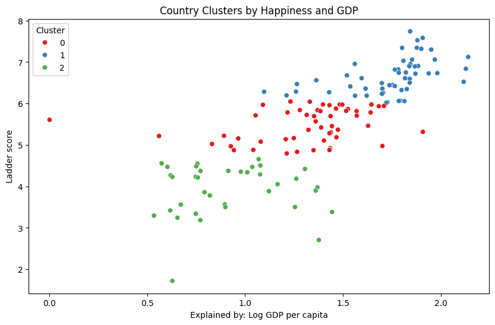

# World-Happiness-Analysis-2024

This project analyzes the World Happiness Report 2024 (WHR2024) dataset to uncover insights into global happiness trends. Using Python, data visualization techniques, and linear regression modeling, we explore key factors affecting happiness across different countries.

# Dataset
 [World Happiness Report 2024 Dataset](https://www.kaggle.com/datasets/ajaypalsinghlo/world-happiness-report-2024)

# Features & Methods

1. Data Preprocessing & Cleaning

 * Dropped rows with missing happiness scores.

 * Filled missing GDP values with the median.

 * Ensured data consistency for analysis.

 2. Feature Correlation Analysis
   
* Generated a heatmap to show correlations between GDP per capita, 

  Social support, Healthy life expectancy and Freedom to make life choices.

2. Machine Learning Model

* Clustering Analysis using K-Means to group countries based on happiness and GDP.
* Linear Regression to examine the impact of key factors on happiness.

  

# Requirements

Install dependencies using:

pip install pandas numpy matplotlib seaborn scikit-learn jupyter

# How to Use

* Clone the repository: git clone https://github.com/yourusername/World-Happiness-Analysis-2024.git

* Open the Jupyter Notebook: jupyter notebook happ.ipynb

* Run the notebook to explore data insights.

# Key Findings & Insights

  Country name  Ladder score
0      Finland         7.741
1      Denmark         7.583
2      Iceland         7.525
3       Sweden         7.344
4       Israel         7.341
5  Netherlands         7.319
6       Norway         7.302
7   Luxembourg         7.122
8  Switzerland         7.060
9    Australia         7.057

Key Drivers of Happiness:
- GDP per capita impact: 1.04
- Social support impact: 1.92

# License

This project is licensed under the MIT License. You are free to use, modify, and share this project with proper attribution.
